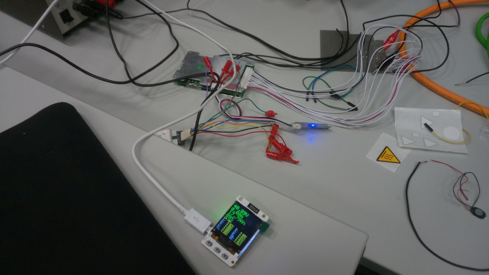
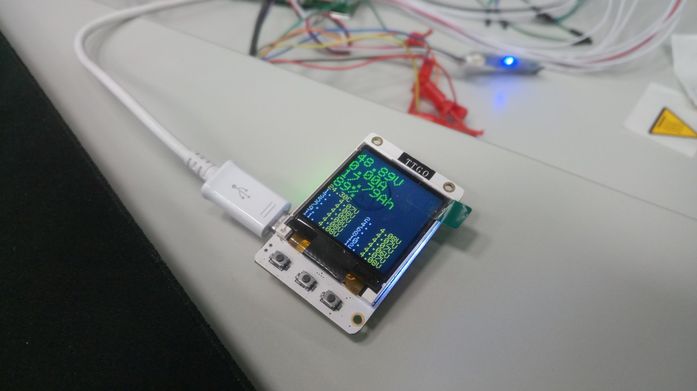

# Smart-BMS-Bluetooth-ESP32
Program to read out and display data from xiaoxiang Smart BMS over Bluetooth Low Energy  
https://www.lithiumbatterypcb.com/  
Tested with original BLE module provided. Might work with generic BLE module when UUIDs are modified  

Needs ESP32 and graphic display.  
Tested on TTGO TS https://github.com/LilyGO/TTGO-TS  

(c) Miroslav Kolinsky 2019  https://www.kolins.cz  

thanks to Petr Jenik for big parts of code  
thanks to Milan Petrzilka  

heavily inspired by https://github.com/bres55/Smart-BMS-arduino-Reader  

known bugs:
* if BLE server is not available during startup, program hangs
* reconnection sort of works, sometimes ESP reboots
* GUI needs to be done

Work in progress...

